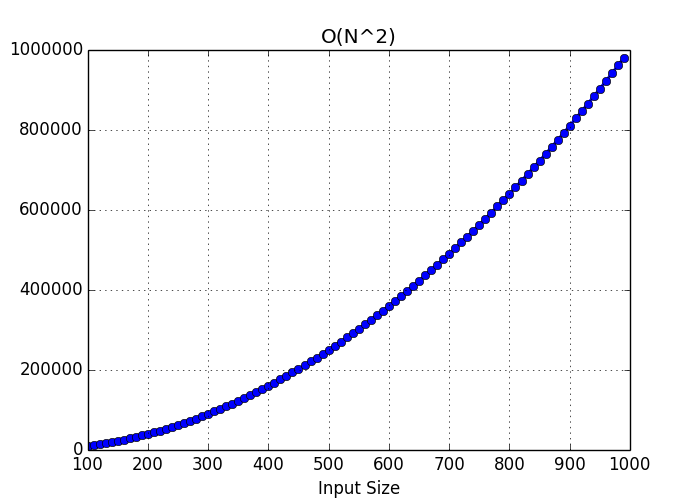

## Big O(n^2) 
printIAndJ js file has a saimple example with two nested for loops. When we have 2 for loops then it should be **O(n) * O(n)** it should be **O(n^2)**.

```javascript
function printIAndJ(n){
    for(let i=0;i<n;i++){
        for(let j=0; j<n;j++){
            console.log(i ,j);
        }
    }
}

printIAndJ(3);
```
**O(n)** operations inside of an **O(n)** operations **O(n * n) = O(n^2)** 

##  Output of the following code

```
0 0
0 1
0 2
1 0
1 1
1 2
2 0
2 1
2 2
```

## Chart 


