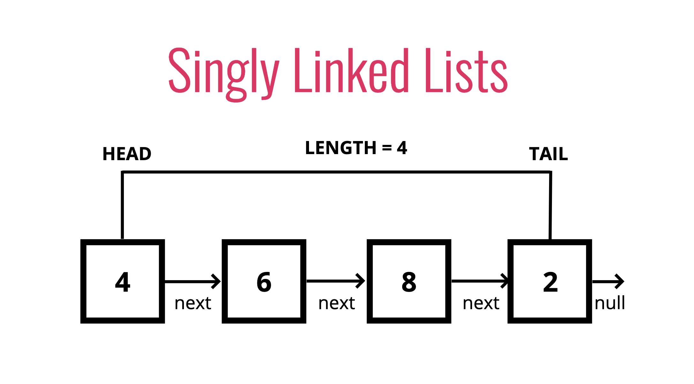

## What is a linked list?

A data structure that contains a head, tail and length property.

Linked Lists consist of nodes, and each node has a value and a pointer to another node or null

## Comparisons with Arrays

### Lists

* Do not have indexes!
* Connected via nodes with a next pointer
* Random access is not allowed

### Arrays

* Indexed in order!
* Insertion and deletion can be expensive
* Can quickly be accessed at a specific index

## Pushing

Adding a new node to the end of the Linked List!

## Pushing pseudocode

* This function should accept a value
* Create a new node using the value passed to the function
* If there is no head property on the list, set the head and tail to be the newly created node
* Otherwise set the next property on the tail to be the new node and set the tail property on the list to be the newly created node
* Increment the length by one
* Return the linked list

## Popping

Removing a node from the end of the Linked List!

## Popping pseudocode

* If there are no nodes in the list, return undefined
* Loop through the list until you reach the tail
* Set the next property of the 2nd to last node to be null
* Set the tail to be the 2nd to last node
* Decrement the length of the list by 1
* Return the value of the node removed

## Shifting

Removing a new node from the beginning of the Linked List!

## Shifting pseudocode

* If there are no nodes, return undefined
* Store the current head property in a variable
* Set the head property to be the current head's next property
* Decrement the length by 1
* Return the value of the node removed

## Unshifting

Adding a new node to the beginning of the Linked List!

## Unshifting pseudocode

* This function should accept a value
* Create a new node using the value passed to the function
* If there is no head property on the list, set the head and tail to be the newly created node
* Otherwise set the newly created node's next property to be the current head property on the list
* Set the head property on the list to be that newly created node
* Increment the length of the list by 1
* Return the linked list

## Get

Retrieving a node by it's position in the Linked List!

## 
